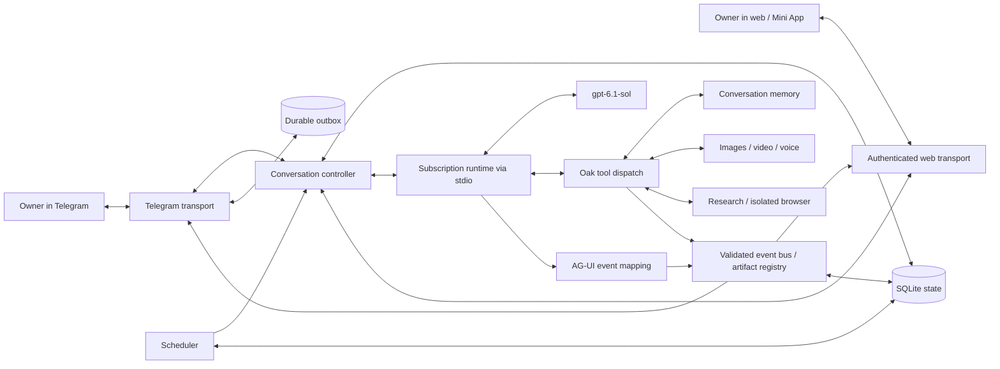

# Oak architecture

Oak combines a persistent conversation controller, Telegram and web transports,
and a catalog of local tools. The runtime process owns inference, its conversation
history and its native tools. Oak owns routing, deployment context, long-term
notes, schedules, approvals and delivery.

## Conversation and runtime

`oak/runtime.py` launches the `codex app-server` dependency over stdio and routes
JSON-RPC requests, notifications and server requests independently. It verifies
ChatGPT account authentication, pins the OpenAI provider, defaults to `gpt-6.1-sol`, and
removes API-key environment overrides. Runtime configuration selects the sandbox,
approval behavior and connected tools.

An authenticated owner can save a model from the native catalogue for a selected
conversation. The next turn uses that model and its advertised default or chosen reasoning
effort without replacing the native thread, history or memory. Accepted work must
finish before the model can change. No failure triggers an alternative model.

Each deployment can select a private runtime home. The example keeps runtime
sessions separate from desktop sessions, which prevents competing writer locks.
Subscription authentication belongs to that runtime home; Oak does not silently
copy credentials or switch to an API account.

`oak/controller.py` keeps one active session per conversation. An idle message
starts a turn; a message arriving during work steers that turn. Per-chat locks
serialize start/steer/stop operations. A start acknowledgement can precede actual
activation, so explicit no-active-turn rejections receive bounded retries;
starting another turn requires evidence that the previous one ended.

`oak/events.py` maps runtime text deltas, tool calls, tool results, execution steps
and run lifecycle events. Tool results have separate message IDs and never become
assistant prose. Private reasoning and native binary image/audio data are excluded;
large tool previews are bounded and explicitly marked as truncated. Registered
custom events carry artifact references, approvals, questions and activity.

`oak/bus.py` validates and stores events before delivery, then distributes them to
independent consumers scoped by conversation and optional run ID. It does not
replace a shared sink when another request starts. Sequence cursors support
reconnect and replay. The original assistant Markdown remains in stored events;
rendering belongs to each channel.

The public SSE transport sends one AG-UI event per `data` frame and a durable
sequence in `id`. JSON polling carries the same events in sequence envelopes.
`to_agui_event` preserves Oak routing and rendering extensions in `metadata` so
public event objects conform to the official schema. Oak implements the event
subset it emits; the web endpoints are Oak's authenticated transport, not the
complete AG-UI RunAgentInput API or every optional protocol extension.

## Input and delivery

`oak/telegram.py` accepts explicitly allowlisted users in private chats. It stores
input before advancing the polling offset, supports attachments and keeps
polling independently of preprocessing and response rendering. Text edits are
coalesced and split to fit Telegram's limits. Generated images, audio, video and files use the
appropriate Telegram upload methods.

`oak/rendering.py` provides one bounded Markdown AST for both clients. Telegram
uses native rich messages where available, with classic HTML fallback only after
an explicit unsupported-method or format rejection. Classic tables become
labelled records. An uncertain send never triggers a fallback send. Parser limits
fall back to the complete literal source. The browser accumulates deltas as text,
then builds the final document from allowed AST nodes with `textContent` and
`createElement`; remote Markdown images are not fetched.

Telegram typing has a dedicated worker with monotonic refresh deadlines and a
short timeout. Its activity keys cover pending inputs and active runs, including
tool waits. Removing one key does not stop another run's activity, and shutdown
cancels and awaits workers. This deployment accepts private chats; Telegram group
topics are not implemented.

The SQLite outbox records progressive replies, message IDs and discrete file or
approval deliveries. Known message IDs permit subsequent edits. A process or
network failure during an initial send can leave its result uncertain; such
sends are not replayed automatically. Durable state improves recovery without
claiming exactly-once delivery.

Startup checks the configured bot identity and rejects a bot with an existing
webhook. A deployment lock prevents another process using the same state
directory. Operators must also avoid starting another poller with a different
state directory against the same bot.

## Web and Mini App

`oak/web.py` serves the same conversation through a web page or Telegram Mini App.
Telegram login verifies signed `initData`, a recent authentication date and the
owner allowlist. Standalone browser login uses a private per-owner access key;
sessions use expiring HttpOnly cookies and an in-memory bearer token for embedded
clients that block third-party cookies. Tokens are never stored in URLs or browser
storage. Conversation access, approval responses
and artifact downloads are checked against the authenticated owner.

The Telegram conversation is shared across its two views. Additional web
conversations have independent runtime threads, memory and active turns. The UI
supports text submission, steering, stopping, approvals, questions and registered
artifact downloads. Tables scroll horizontally and have keyboard focus. Arbitrary
local paths are never used as public artifact URLs.

The official Telegram SDK is cached privately and served through Oak's own origin.
Its asynchronous loading does not block the page. Startup signals readiness to
Telegram, validates signed launch data even if the SDK is delayed, and bounds
authentication requests so a failure shows a recoverable sign-in message.

Use SSE behind a streaming-capable HTTPS endpoint or select JSON long polling.
The optional managed Quick Tunnel uses polling and a temporary hostname; it is a
preview path, not a stable production address. `sendRichMessageDraft` is not
implemented; actual runtime text streaming and temporary Telegram draft messages
are separate features.

## Context and memory

`oak/context.py` reads only explicitly configured instructions and memory files.
These provide startup context. `oak/memory.py` stores independently editable,
chat-scoped notes and retrieves them with SQLite full-text search. New runtime
sessions receive selected recent notes; tools can search or change memory during
an ongoing conversation.

The importer accepts selected plain text or a JSON folder containing `profile`
and `logs`. It does not discover remote memories automatically. When another
service stores memory on its server, an authorized export is required. Missing
local files do not demonstrate that remote memory is empty. Importing notes also
does not import the source service's full conversation history.

## Scheduling and interactions

`oak/schedule.py` persists one-time and recurring reminders and assistant tasks.
Reminders produce a chat notice. Scheduled agent work waits for an idle chat
instead of steering an owner's active task. Intervals are at least 60 seconds;
naive dates use the configured IANA timezone. On recovery, interrupted jobs are
marked uncertain rather than executed again automatically.

`oak/interaction.py` routes runtime approval requests and follow-up questions to
the originating chat. The owner responds through Telegram buttons or commands.
Interactive responses are scoped to their request and conversation. The runtime
sandbox governs runtime execution; Oak's separately implemented adapters have
their own filesystem and input checks.

## Tool adapters

| Module | Responsibility |
| --- | --- |
| `oak/tools.py` | Native tool schemas, conversation routing and artifact delivery |
| `oak/media.py` | Pillow title cards, FFmpeg previews/montages, Piper narration and local speech recognition |
| `oak/research.py` | Public text-page retrieval, Bing RSS or configured SearXNG search, public YouTube metadata |
| `oak/browser.py` | A dedicated persistent Playwright profile and browser actions |

Native image generation is a runtime capability whose availability depends on
the signed-in account. Local title cards are rendered typography and layouts.
MP4 previews are assembled from images with FFmpeg. External applications and
other providers require their own configured access. Native connected-app tools
use the signed-in runtime account; listing an app does not prove every operation
or external write is available.

## Deployment state

The state directory contains controller databases, durable UI events, artifact
registrations, web login keys/sessions, the Telegram offset and outbox, and
process-management state. The workspace contains accepted input
files, generated artifacts and Oak's browser profile. Keep both private and
persistent. The repository contains source and portable examples only.
