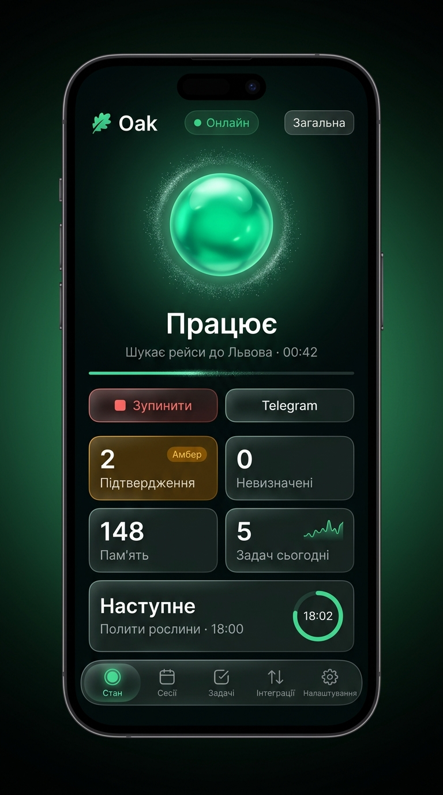
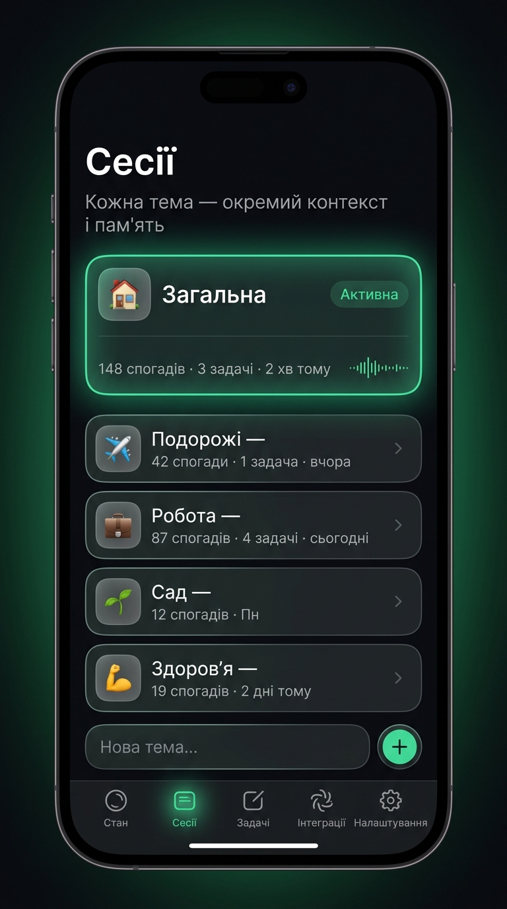
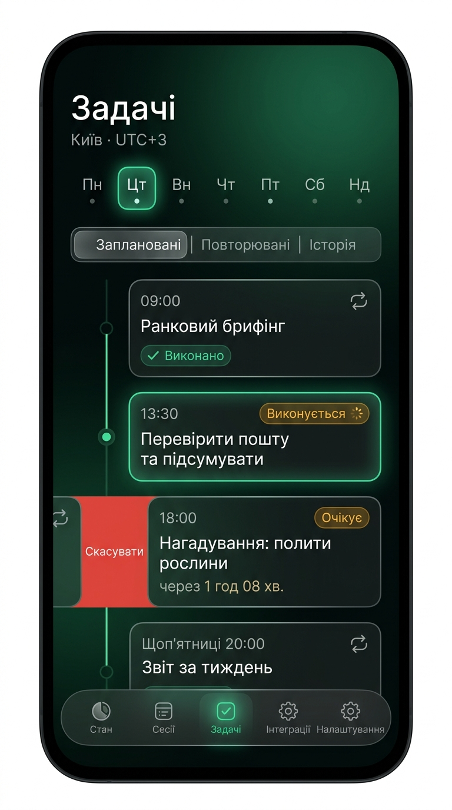
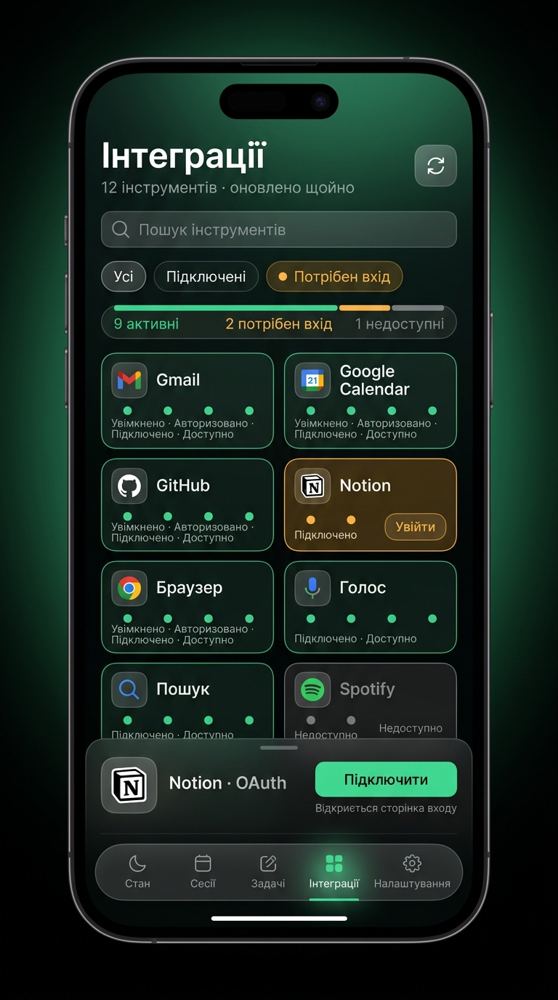
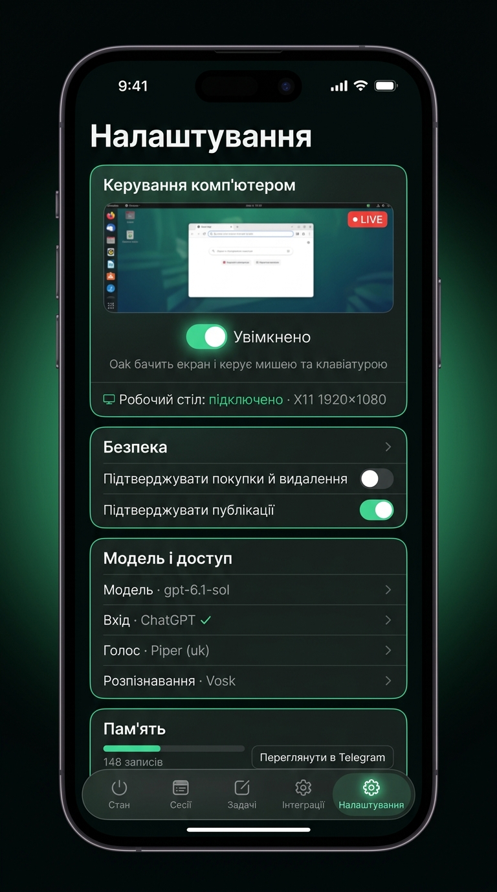

# Oak — Концепт UI/UX та макети керування («Living Control Center»)

## Огляд редизайну

Панель керування Oak (Telegram Mini App та веб-інтерфейс) оновлена до футуристичного стилю «Living Control Center» для домашнього ШІ-асистента.

### Візуальна мова

| Елемент | Реалізація |
| --- | --- |
| **Тема** | Dark mode, глибокий темний фон (`#050a08`) з м’яким лісово-смарагдовим радіальним сяйвом |
| **Поверхні** | Матове скло (Glassmorphism), тонка рамка `1px` (`rgba(255, 255, 255, 0.085)`), скруглення `22px` |
| **Акценти** | Смарагдовий `#3DDC97` (активний стан, успіх), бурштиновий `#F5B14C` (увага/підтвердження), червоний `#FF7A72` (зупинка) |
| **Центральний образ** | **Живий ШІ-орб Oak**: дихає в режимі очікування, прискорюється під час виконання задачі, переходить у бурштиновий пульс, коли потрібна дія власника |
| **Навігація** | Мобільні пристрої: плаваюча скляна панель вкладок знизу з іконками. Десктоп: бокова панель-рейл та bento-розкладка |
| **Адаптивність** | Повна підтримка Telegram Mini App (налаштування headerColor та backgroundColor), десктопних моніторів та жестів |

---

## Макети інтерфейсу

Нижче — ілюстративні макети із синтетичними даними, а не підтвердження
підключених сервісів. Реальний інтерфейс додатково містить вибір моделі сесії.

### 1. Стан (Головний екран)
Центральний живий орб Oak, кнопка екстреної зупинки, Bento-плитки метрик розмови (підтвердження, невизначені запити, пам’ять, задачі) та картка найближчого запуску.

---

### 2. Сесії (Теми спілкування)
Контекстні теми діалогу в Telegram. Активна сесія підсвічена сяйвом та індикатором живої активності, швидке створення нової теми без виходу з панелі.

---

### 3. Задачі (Розклад та нагадування)
Хронологічна шкала запланованих нагадувань і дій Oak з інтерактивними маркерами статусів (виконується, очікує, завершено) та історією виконання.

---

### 4. Інтеграції (Інструменти та сервіси)
Модульна сітка підключених сервісів із відображенням детальних рівнів доступу (увімкнено, авторизовано, підключено, доступно) та безпечною авторизацією.

---

### 5. Налаштування (Керування комп'ютером та безпека)
Управління режимом Computer Use (перемикач доступу до екрана, миші й клавіатури з індикацією реального стану сервера), параметри sandbox та вибір моделі для обраної сесії з реального каталогу runtime. Типова модель — `gpt-6.1-sol`; зміна потребує підтвердження власника.

---

## Що реалізовано в коді

1. **`oak/web/index.html`**:
   - Нова модульна bento-структура зі збереженням повної доступності (ARIA, live regions, roles).
   - SVG-іконки в навігації, кнопках дій та картках.
   - Адаптивні секції для мобільного та десктопного перегляду.
   - Збережено всі ідентифікатори та елементи, необхідні для бекенду і тестів.

2. **`oak/web/style.css`**:
   - Повна дизайн-система dark glassmorphism на CSS-змінних.
   - Анімований живий ШІ-орб (keyframe-анімації breathe, halo, ping, shimmer) із відключенням для `prefers-reduced-motion`.
   - Десктопний боковий рейл (side rail) та мобільна плаваюча скляна панель.
   - Таймлайн-верстка для списку запланованих задач.

3. **`oak/web/app.js`**:
   - Відображення серверного підсумку всіх активних задач і найближчого запуску (час і тип, без приватного тексту задач).
   - Візуальне акцентування плиток, що вимагають реакції користувача (бурштинове підсвічування).
   - Підтримка детальних статусів з'єднання (онлайн, оновлення, частковий стан).
   - Синхронізація кольорів теми Telegram WebApp (`#050a08`).
